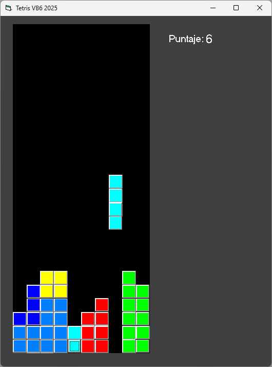

# 🎮 Tetris en VB6



Un clásico juego de Tetris implementado en Visual Basic 6, perfecto para revivir la nostalgia de los juegos clásicos. Este proyecto es un ejemplo de técnicas avanzadas de programación en VB6, creado con vibe coding, incluyendo manipulación de controles, gestión de colisiones y lógica de juego.

## 🎯 Características

- **Jugabilidad clásica**: Sigue las reglas tradicionales del Tetris
- **Controles intuitivos**: Usa el teclado o botones en pantalla
- **Sistema de puntuación**: Registra tu puntuación más alta
- **Diferentes piezas**: Incluye las 7 piezas clásicas del Tetris
- **Aceleración**: La velocidad aumenta a medida que avanzas
- **Interfaz limpia**: Diseño simple y fácil de usar

## 🎮 Controles

- **W / Botón Rotar**: Rotar la pieza actual
- **A / Botón Izquierda**: Mover a la izquierda
- **D / Botón Derecha**: Mover a la derecha
- **S / Botón Acelerar**: Bajar la pieza más rápido
- **Barra espaciadora**: Caída instantánea

## 🛠️ Requisitos Técnicos

- Windows 95 o superior
- Visual Basic 6 Runtime (si se compila como ejecutable)
- 800x600 resolución mínima recomendada

## 🚀 Cómo Ejecutar

1. Clona o descarga este repositorio
2. Abre el archivo `Tetris.vbp` en Visual Basic 6
3. Presiona F5 para ejecutar el proyecto

## 🧩 Estructura del Proyecto

- `Form1.frm`: Contiene la lógica principal del juego
- `Tetris.vbp`: Archivo de proyecto de Visual Basic 6
- `README.md`: Este archivo de documentación

## 🎨 Personalización

Puedes personalizar fácilmente el juego modificando las constantes al inicio del código:

```vb
Const BOX_SIZE = 400     ' Tamaño de cada bloque
Const GRID_WIDTH = 10    ' Ancho de la grilla
Const GRID_HEIGHT = 24   ' Alto de la grilla
```

## 📄 Licencia

Este proyecto está bajo la Licencia GNU General Public License v3.0. Consulta el archivo `LICENSE` para más información.

---

Desarrollado con ❤️ usando vibe coding en Visual Basic 6